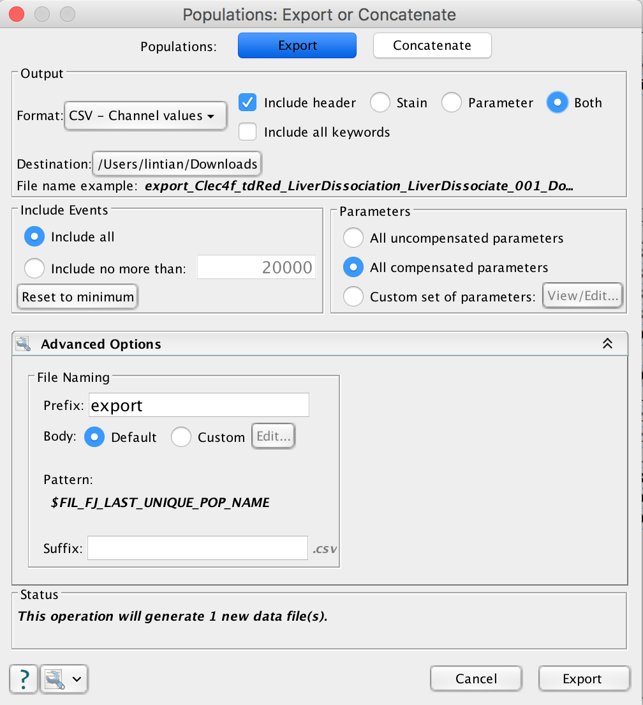
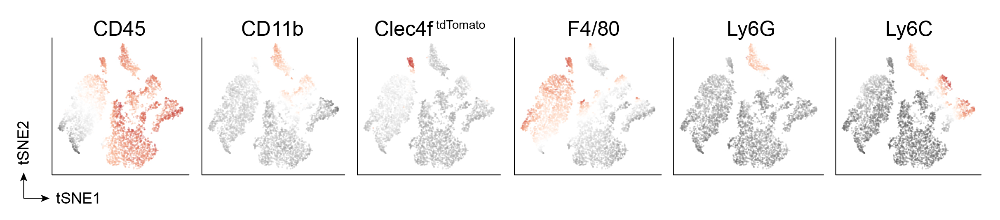

t-SNE Analysis for Flow Cytometry Data
======================================

t-Distributed Stochastic Neighbor Embedding (**t-SNE**) is a non-linear technique for dimensionality reduction that is particularly well suited for the visualization of high-dimensional datasets.

This tutorial will use [FlowJo](https://www.flowjo.com/) to load FSC file(s), gate alive population and export CSV file containing compensated values. We will load the CSV file and use R packages to perform tSNE analysis.

This totorial will use 7-color staining of myeloid cells in liver of Clec4f-Cre.

Marker | Fluorescence/Channel| 
:------:|:----------------:|
DAPI (cell viability) | BUV395 |
CD45 | PerCP-Cy5.5 |
CD11b | APC-Cy7 |
F4/80 | BV510 |
Ly6C | PE-Cy7 |
Ly6G | APC |
dTomato | PE |


## FlowJo

To compare samples, we will merge the samples together into a single FCS file first (a process called concatenation), and then perform dimensionality reduction on the concatenated data set.

During the concatenation step, we will create new derived parameters based on keyword/value pairs (such as timepoints, treatment groups, or simulations).

* Clean up the data

We will first apply manual gates to exclude doublets and debris by FSC and SSC channels. Then, we will use DAPI to eliminate dead cells from each sample. This step reduces noise in the data and can improve the tSNE algorithm output.

* Downsample

It is recommended to initiate the calculation on a gated population containing no more than 20,000 events.

Choose **Workspace** -> **Plugins** -> **DownSampleV3**

* Export Data

Choose **File** -> **Export/Concatenate** -> **Export / Concatenate Populations**.



## tSNE Analysis Using R

### tSNE

```{r}
# install.packages("Rtsne")
library(Rtsne)
FACS <- read.csv("FACS_Files/export_Downsample.csv")
FACS2 <- FACS[, grepl("Comp", colnames(FACS))]
FACS3 <- FACS2[, -which(colnames(FACS2) == "Comp.BUV.395.A")]
FACS3.dm <- data.matrix(FACS3)

set.seed(123)  # set random seed
rtsne_out <- Rtsne(FACS3.dm, pca = FALSE, verbose = TRUE, perplexity = 100) ## The larger perplexity, the longer it takes to finished analysis. But the ponts will be more separated.
names(rtsne_out)
FACS_tSNE_df <- cbind(FACS3, data.frame(tSNE1=rtsne_out$Y[, 1], tSNE2=rtsne_out$Y[, 2]))
```

### Dimention Reduction 1: tSNE

```{r}
library(ggplot2)
library(RColorBrewer)
set.seed(123)
FACS_tSNE_df_sample <- FACS_tSNE_df[sample(1:nrow(FACS_tSNE_df), 5000), ]

## CD45

CD45_p <- ggplot(FACS_tSNE_df_sample) + geom_point(aes(x=tSNE1, y=tSNE2, color=Comp.PerCP.Cy5.5.A), alpha=0.32, shape=16, size=2) + scale_color_gradientn(colors=rev(brewer.pal(n=9, name="RdGy")))+ theme_bw() + theme(panel.grid.major=element_blank(), panel.grid.minor=element_blank(), panel.border=element_blank(), axis.line.x=element_line(colour="black"), axis.line.y=element_line(colour="black"), legend.title=element_text(colour="black"))
ggsave("~/CD45_p.pdf", CD45_p, width=8.32, height=6.28, units="in", useDingbats=FALSE)

APC.Cy7_p <- ggplot(FACS_tSNE_df_sample) + geom_point(aes(x=tSNE1, y=tSNE2, color=Comp.APC.Cy7.A), alpha=0.32, shape=16, size=2) + scale_color_gradientn(colors=rev(brewer.pal(n=9, name="RdGy")))+ theme_bw() + theme(panel.grid.major=element_blank(), panel.grid.minor=element_blank(), panel.border=element_blank(), axis.line.x=element_line(colour="black"), axis.line.y=element_line(colour="black"), legend.title=element_text(colour="black"))
ggsave("~/APC.Cy7_p.pdf", APC.Cy7_p, width=8.32, height=6.28, units="in", useDingbats=FALSE)

tdTomato_p <- ggplot(FACS_tSNE_df_sample) + geom_point(aes(x=tSNE1, y=tSNE2, color=Comp.tdTomato.A), alpha=0.32, shape=16, size=2) + scale_color_gradientn(colors=rev(brewer.pal(n=9, name="RdGy")))+ theme_bw() + theme(panel.grid.major=element_blank(), panel.grid.minor=element_blank(), panel.border=element_blank(), axis.line.x=element_line(colour="black"), axis.line.y=element_line(colour="black"), legend.title=element_text(colour="black"))
ggsave("~/tdTomato_p.pdf", tdTomato_p, width=8.32, height=6.28, units="in", useDingbats=FALSE)

BV510_p <- ggplot(FACS_tSNE_df_sample) + geom_point(aes(x=tSNE1, y=tSNE2, color=Comp.BV510.A), alpha=0.32, shape=16, size=2) + scale_color_gradientn(colors=rev(brewer.pal(n=9, name="RdGy")))+ theme_bw() + theme(panel.grid.major=element_blank(), panel.grid.minor=element_blank(), panel.border=element_blank(), axis.line.x=element_line(colour="black"), axis.line.y=element_line(colour="black"), legend.title=element_text(colour="black"))
ggsave("~/BV510_p.pdf", BV510_p, width=8.32, height=6.28, units="in", useDingbats=FALSE)

APC_p <- ggplot(FACS_tSNE_df_sample) + geom_point(aes(x=tSNE1, y=tSNE2, color=Comp.APC.A), alpha=0.32, shape=16, size=2) + scale_color_gradientn(colors=rev(brewer.pal(n=9, name="RdGy")))+ theme_bw() + theme(panel.grid.major=element_blank(), panel.grid.minor=element_blank(), panel.border=element_blank(), axis.line.x=element_line(colour="black"), axis.line.y=element_line(colour="black"), legend.title=element_text(colour="black"))
ggsave("~/APC_p.pdf", APC_p, width=8.32, height=6.28, units="in", useDingbats=FALSE)

PE.Cy7_p <- ggplot(FACS_tSNE_df_sample) + geom_point(aes(x=tSNE1, y=tSNE2, color=Comp.PE.Cy7.A), alpha=0.32, shape=16, size=2) + scale_color_gradientn(colors=rev(brewer.pal(n=9, name="RdGy"))) + theme_bw() + theme(panel.grid.major=element_blank(), panel.grid.minor=element_blank(), panel.border=element_blank(), axis.line.x=element_line(colour="black"), axis.line.y=element_line(colour="black"), legend.title=element_text(colour="black"))
ggsave("~/PE.Cy7_p.pdf", PE.Cy7_p, width=8.32, height=6.28, units="in", useDingbats=FALSE)
```



### Dimention Reduction 2: umap

Uniform Manifold Approximation and Projection (UMAP) is an algorithm for dimensional reduction.

```{r}
# install.packages("umap")
library(umap)
FACS.umap <- umap(FACS3) ## FACS is a data frame, in which row represents cells and column represents fluorescence channels
FACS.umap
names(FACS.umap)
FACS3$UMAP1 <- FACS.umap$layout[, 1]
FACS3$UMAP2 <- FACS.umap$layout[, 2]
```

The main component of the object is `layout`, which holds a matrix with coordinates.

```{r}
library(ggplot2)
library(RColorBrewer)

ggplot(FACS3) + geom_point(aes(x=UMAP1, y=UMAP2, color=Comp.PerCP.Cy5.5.A), alpha=0.32, shape=16, size=2) + scale_color_gradientn(colors=rev(brewer.pal(n=9, name="RdGy")))+ theme_bw() + theme(panel.grid.major=element_blank(), panel.grid.minor=element_blank(), panel.border=element_blank(), axis.line.x=element_line(colour="black"), axis.line.y=element_line(colour="black"), legend.title=element_text(colour="black"))
ggsave("~/CD45_p.pdf", CD45_p, width=8.32, height=6.28, units="in", useDingbats=FALSE)

ggplot(FACS3) + geom_point(aes(x=UMAP1, y=UMAP2, color=Comp.APC.Cy7.A), alpha=0.32, shape=16, size=2) + scale_color_gradientn(colors=rev(brewer.pal(n=9, name="RdGy")))+ theme_bw() + theme(panel.grid.major=element_blank(), panel.grid.minor=element_blank(), panel.border=element_blank(), axis.line.x=element_line(colour="black"), axis.line.y=element_line(colour="black"), legend.title=element_text(colour="black"))

tdTomato_p <- ggplot(FACS3) + geom_point(aes(x=UMAP1, y=UMAP2, color=Comp.tdTomato.A), alpha=0.32, shape=16, size=2) + scale_color_gradientn(colors=rev(brewer.pal(n=9, name="RdGy")))+ theme_bw() + theme(panel.grid.major=element_blank(), panel.grid.minor=element_blank(), panel.border=element_blank(), axis.line.x=element_line(colour="black"), axis.line.y=element_line(colour="black"), legend.title=element_text(colour="black"))
ggsave("~/tdTomato_p.pdf", tdTomato_p, width=8.32, height=6.28, units="in", useDingbats=FALSE)

BV510_p <- ggplot(FACS3) + geom_point(aes(x=UMAP1, y=UMAP2, color=Comp.BV510.A), alpha=0.32, shape=16, size=2) + scale_color_gradientn(colors=rev(brewer.pal(n=9, name="RdGy")))+ theme_bw() + theme(panel.grid.major=element_blank(), panel.grid.minor=element_blank(), panel.border=element_blank(), axis.line.x=element_line(colour="black"), axis.line.y=element_line(colour="black"), legend.title=element_text(colour="black"))
ggsave("~/BV510_p.pdf", BV510_p, width=8.32, height=6.28, units="in", useDingbats=FALSE)

APC_p <- ggplot(FACS3) + geom_point(aes(x=UMAP1, y=UMAP2, color=Comp.APC.A), alpha=0.32, shape=16, size=2) + scale_color_gradientn(colors=rev(brewer.pal(n=9, name="RdGy")))+ theme_bw() + theme(panel.grid.major=element_blank(), panel.grid.minor=element_blank(), panel.border=element_blank(), axis.line.x=element_line(colour="black"), axis.line.y=element_line(colour="black"), legend.title=element_text(colour="black"))
ggsave("~/APC_p.pdf", APC_p, width=8.32, height=6.28, units="in", useDingbats=FALSE)

PE.Cy7_p <- ggplot(FACS3) + geom_point(aes(x=UMAP1, y=UMAP2, color=Comp.PE.Cy7.A), alpha=0.32, shape=16, size=2) + scale_color_gradientn(colors=rev(brewer.pal(n=9, name="RdGy"))) + theme_bw() + theme(panel.grid.major=element_blank(), panel.grid.minor=element_blank(), panel.border=element_blank(), axis.line.x=element_line(colour="black"), axis.line.y=element_line(colour="black"), legend.title=element_text(colour="black"))
ggsave("~/PE.Cy7_p.pdf", PE.Cy7_p, width=8.32, height=6.28, units="in", useDingbats=FALSE)
```

## Clustering

We will use [Rphenograph](https://github.com/JinmiaoChenLab/Rphenograph) to cluster the cells.

```{r}
# install.packages("devtools")
# devtools::install_github("JinmiaoChenLab/Rphenograph")
```

If you got error message "Error in curl::curl_fetch_memory", the command below can solve this problem.

In R:

```{r}
remove.packages('curl')
```

In console:

```
sudo apt-get remove libcurl4-nss-dev
sudo apt-get install libcurl4-openssl-dev
```

Then install `curl` package again in R:

```{r}
install.packages('curl')
```

### tSNE-Rphenograph

```{r}
FACS_tSNE_df_sample.mn <- data.matrix(FACS_tSNE_df_sample[,1:6]) ## 6 parameters not including tSNE
Rphenograph_out_tSNE <- Rphenograph(FACS_tSNE_df_sample.mn, k = 45)
modularity(Rphenograph_out_tSNE[[2]])
membership(Rphenograph_out_tSNE[[2]])
FACS_tSNE_df_sample$phenograph_cluster <- factor(membership(Rphenograph_out_tSNE[[2]]))

tSNE_Rphenograph <- ggplot(FACS_tSNE_df_sample) + geom_point(aes(x=tSNE1, y=tSNE2, color=phenograph_cluster), alpha=0.32, shape=16, size=2) + theme_bw() + theme(panel.grid.major=element_blank(), panel.grid.minor=element_blank(), panel.border=element_blank(), axis.line.x=element_line(colour="black"), axis.line.y=element_line(colour="black"), legend.title=element_text(colour="black"))
```

### uMAP-Rphenograph

```{r}
FACS3.mn <- data.matrix(FACS3[,1:6]) ## 6 parameters not including tSNE
Rphenograph_out_uMAP <- Rphenograph(FACS3.mn, k = 45)
modularity(Rphenograph_out_uMAP[[2]])
membership(Rphenograph_out_uMAP[[2]])
FACS3$phenograph_cluster <- factor(membership(Rphenograph_out_uMAP[[2]]))

uMAP_Rphenograph <- ggplot(FACS3) + geom_point(aes(x=UMAP1, y=UMAP2, color=phenograph_cluster), alpha=0.32, shape=16, size=2) + theme_bw() + theme(panel.grid.major=element_blank(), panel.grid.minor=element_blank(), panel.border=element_blank(), axis.line.x=element_line(colour="black"), axis.line.y=element_line(colour="black"), legend.title=element_text(colour="black"))
```

